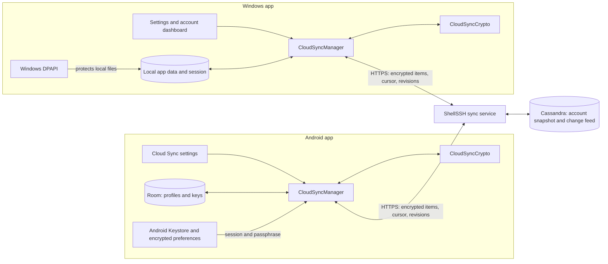
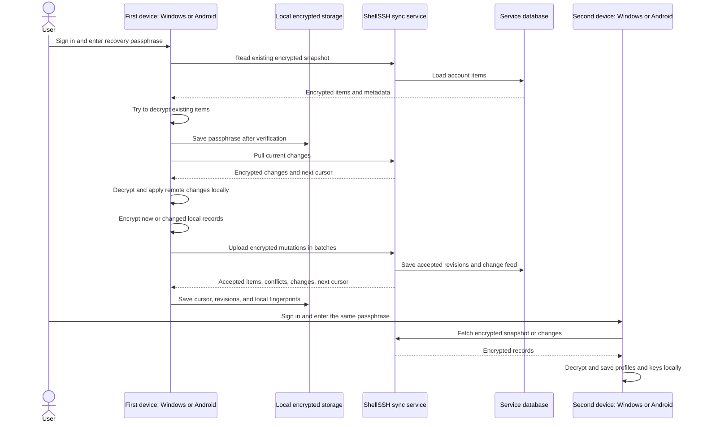
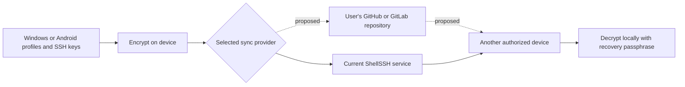

# ShellSSH cloud sync architecture: Windows and Android

This document describes the current ShellSSH cloud sync implementation across the Windows and Android apps. It covers what crosses the network, how both clients read the same encrypted records, and where their local behavior differs. The GitHub/GitLab storage idea at the end is a possible future design, not a feature available in either app today.

## At a glance

- Cloud sync is optional and disabled by default. It requires a signed-in account, an allowed `cloud_sync` feature policy, and a recovery passphrase of at least 12 characters.
- Both clients sync server profiles and saved SSH keys. Profile data includes connection details and credentials; key data includes private key material and any key passphrase. Windows reads a file-backed private key before encrypting it for sync.
- Each client encrypts records before upload. The current service stores ciphertext and sync metadata, and sends encrypted records to another signed-in device.
- SSH sessions, terminal output, and SFTP file contents are not part of these sync records.
- Turning sync off stops further sync attempts. It does not delete records already stored with the account.

## Current architecture

Both apps are encryption boundaries. They read local credentials, create the same portable encrypted record format, and send it to the service. The service authenticates the account, checks its cloud-sync entitlement, validates transport fields, assigns revisions, and stores the record. It does not need the recovery passphrase to perform sync. A record written on one platform can be decrypted on the other with the same account and recovery passphrase.

The service can still see the account, item type, item ID, revision, deletion state, timestamps, ciphertext size, and sync activity. Encryption does not conceal that metadata.

## First setup and normal sync

On an empty account, there is no existing ciphertext against which to verify the first passphrase. That first passphrase becomes the one needed to read subsequently uploaded records. On a new installation, the user must enter the same passphrase; both clients test it against existing encrypted items before saving it locally or uploading records. If the account has no readable encrypted items, that test cannot establish that a passphrase matches earlier data.

During a normal sync, both clients send pending SSH-key deletions before pulling so an older cloud copy is not restored. Android then explicitly pulls and applies remote changes before preparing local mutations. Windows pulls changes as part of its first sync request, then builds local mutations. Both upload in batches of at most 100 mutations. The service returns an initial snapshot when there is no cursor, followed by incremental changes. Responses are paginated; each client continues while more pages remain and advances its cursor after applying a page.

Each item carries a revision. The service compares an upload's expected revision with the stored revision and returns a conflict when they differ. Both managers report conflict counts and details in sync state; the current implementation should not be described as providing an interactive conflict-resolution workflow. Deletions are represented as tombstones. Android also detects deleted server profiles by comparing local IDs with previously known cloud IDs; Windows explicitly tracks pending SSH-key deletions.

## Encryption and local storage

| Area | Shared format or platform behavior |
| --- | --- |
| Cloud record encryption | AES-256-GCM, performed on the client before upload. |
| Key derivation | PBKDF2-HMAC-SHA256 with 600,000 iterations and a fresh 16-byte salt per item. |
| Nonce and authentication | Fresh 12-byte nonce per item; 128-bit GCM tag. Item type and item ID are authenticated as additional data. |
| Transport format | Base64 envelope containing format version, salt, nonce, and ciphertext; a SHA-256 checksum covers the encoded payload in transit/storage. |
| Recovery passphrase | Entered separately on each device. It is not included in sync mutations. Android saves it per account in Keystore-backed encrypted preferences; Windows saves it in its DPAPI-protected session file. |
| Android local data | SSH private keys, passwords, and passphrases are encrypted with an Android Keystore key before local storage. Server metadata is stored in Room for local use. |
| Windows local data | App data and session JSON files are protected with Windows DPAPI for the current user. The session contains the passphrase and sync cursor; app data contains profiles, keys, revisions, and fingerprints. |
| Transport | Both clients use HTTPS for the current service. Android release builds reject a non-HTTPS configured service address. |

The transport checksum detects accidental or deliberate changes to the encoded payload, but it is not a substitute for AES-GCM authentication. The backend checks that sensitive item types declare an encryption version; the client performs the actual encryption and decryption. A compromised device, exposed recovery passphrase, malicious client build, or weak passphrase can still put keys at risk. This design has not been independently audited.

## Scheduling, failure, and retention

**Android:** The app can start sync after a valid account session becomes available when sync was previously enabled. Users can also run it from Cloud Sync settings. A sync attempt has a 60-second client timeout. After a failure, WorkManager schedules a network-constrained retry with an initial 15-minute delay and linear backoff. Disabling sync cancels the retry work.

**Windows:** Users can start sync from Settings or the account dashboard; enabling sync starts a sync attempt. The API client has a 30-second HTTP timeout per request. The current Windows manager reports a failure but does not schedule a background retry. Signing out clears the DPAPI-protected session's passphrase and cursor. Local app data remains on that device.

The backend keeps the current item snapshot and a change feed. The change-feed entries have a 90-day time to live; an old client may need a fresh snapshot. Disabling sync or uninstalling the app does not itself remove account data already stored by the service. Account and cloud-data deletion is handled through the process described in the privacy policy.

## Deployment and self hosting status

Windows and Android are installed SSH clients. Android's configured backend address can be changed at build time; the Windows API client also has a configurable base-address property in code. Cloud sync depends on a compatible backend with account authentication, feature policy, revisions, cursors, and storage. There is currently no published, supported self-hosted sync distribution or user-facing setting to choose a personal sync server. The Android repository has no project-wide open source license; access to a source checkout should not be presented as an open source release.

## Possible future: user-controlled GitHub or GitLab storage

This is a design direction only. No GitHub/GitLab sync provider is implemented in either client.

A provider option would need a documented encrypted file format, scoped provider authorization, safe token storage, atomic writes or version checks, conflict handling, deletion propagation, and recovery when a device is offline. A GitHub or GitLab cloud repository would still store encrypted data with a third party. A user-operated GitLab instance could support actual self hosting, but that would require explicit compatibility and setup work. The current account-backed cursor and revision protocol cannot simply be assumed to work unchanged with repository files.

## Cloud Sync Disclaimer
ShellSSH encrypts synchronized records on your device, and the service is not designed to decrypt them. No security system can guarantee complete protection against compromised devices, weak recovery credentials, malicious updates, or implementation flaws. Cloud sync remains optional.

